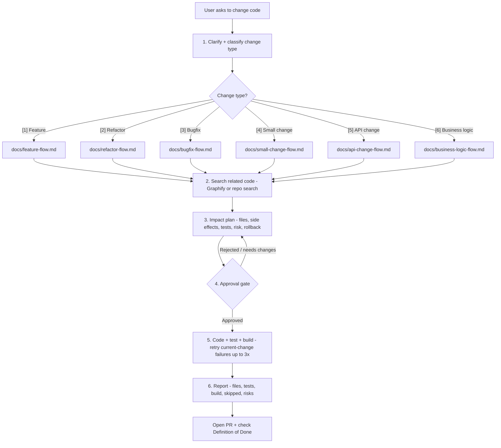

# SDLC Lean Workflow

## Purpose

Provide a repeatable, low-ceremony workflow for team development with AI assistance.

## Flow

1. Clarify request.
2. Classify change type.
3. Search related code with Graphify.
4. Produce impact plan.
5. Wait for approval.
6. Implement.
7. Test/build/validate.
8. Report evidence.
9. Review and merge.

## Flow map

- **Approval gate** is the hard stop: no non-trivial edits before approval. Risk level (`docs/risk-matrix.md`) decides approval strength.
- The per-type flow doc (`docs/*-flow.md`) refines steps 2-6 for that change type.
- Closing checks: `docs/definition-of-done.md`, `.github/PULL_REQUEST_TEMPLATE.md`, `scripts/validate-workflow.ps1`.

## Required outputs

| Step | Output |
|---|---|
| Clarify | change type, scope, acceptance criteria |
| Search | related files/functions/tests |
| Impact | files, side effects, risk, rollback |
| Approval | explicit approval before edits |
| Execution | code + tests/build |
| Report | evidence, skipped checks, risks |

## Non-negotiables

- No non-trivial code edits before approval.
- No merge without review evidence.
- No hidden skipped checks.
- High-risk changes need stronger approval.
